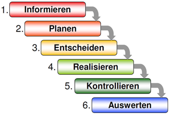

# Blob Storage & Azure Zertifizierung 

- [Blob Storage \& Azure Zertifizierung](#blob-storage--azure-zertifizierung)
- [Versionenverzeichniss](#versionenverzeichniss)
- [Teil 1 Einleitung](#teil-1-einleitung)
- [Aufgabenstellung](#aufgabenstellung)
  - [Ausgangslage](#ausgangslage)
  - [Mittel und Methoden](#mittel-und-methoden)
    - [Software](#software)
    - [Programmiersprache](#programmiersprache)
  - [Werkzeuge](#werkzeuge)
  - [Methode IPERKA](#methode-iperka)
  - [Seusag](#seusag)
    - [Systemgrenzen](#systemgrenzen)
- [Projektorganisation](#projektorganisation)
  - [Beteiligte Personen](#beteiligte-personen)
    - [Kanditatin](#kanditatin)
    - [Dozenten](#dozenten)
- [Datensicherung](#datensicherung)
- [Zeitplan](#zeitplan)
- [Lernplan](#lernplan)
- [Besprechungsprotokoll](#besprechungsprotokoll)
  - [Zwischengespräch 1](#zwischengespräch-1)
    - [Besprechungsnotiz](#besprechungsnotiz)
  - [Zwischengespräch 2](#zwischengespräch-2)
    - [Besprechungsnotiz](#besprechungsnotiz-1)


# Versionenverzeichniss

| Version | Datum | Autor | Bemerkung | 
| ------- | ------ | ---- | --------- |
| 1.0 | .2024 | Laura Dubach | |


# Teil 1 Einleitung

# Aufgabenstellung


## Ausgangslage


## Mittel und Methoden
### Software
### Programmiersprache
## Werkzeuge
## Methode IPERKA
Dies ist eine Sechs-Schritte-Methode, welche man für die Umsetzung eines Projektes verwendet. Sie hilft dabei, ein Projekt von Grund auf gut zu planen und zu verstehen. Man soll jeden Schritt genau durchführen, um jegliche Probleme umgehen zu können. Zum Schluss der Methode wird auch verlangt, dass man das Projekt reflektiert, um aus allfälligen Fehlern auch lernen zu können.  
> (Bexio 2020) [Quelle](https://www.bexio.com/de-CH/blog/view/iperka-methode)



Für diese Methode habe ich mich entschieden, da wir diese in meiner Lehre für alle Projekte angewandt haben und ich gute Erfahrungen damit gemacht habe. Dadurch kenne ich diese Methode schon gut und kann sie dementsprechend anwenden.

## Seusag
### Systemgrenzen
# Projektorganisation
## Beteiligte Personen

### Kanditatin

```
Laura Joana Dubach
Funktion: Projektleiterin
P: 079 355 78 24
Github: lauradubach
E-Mail: laura.dubach@itnetx.ch
```
### Dozenten

```
Philipp Rohr
Funktion: Fachdozent
Github: phrohr
E-Mail: philipp.rohr@tbz.ch
```


# Datensicherung
Damit keine Daten verloren gehen können, werde ich alle Dokumente auf meinem OneDrive abspeichern. Zusätzlich werde ich die Daten auf einen USB-Stick abspeichern, damit ich im Worstcase Szenario immer noch ein Backup besitze. 

# Zeitplan

# Lernplan

# Besprechungsprotokoll
## Zwischengespräch 1

| Besprechung | Datum | Uhrzeit | Teilnehmer | 
| ---- | ---- | ---- | ---- |
| 1 |  |  | Philipp Rohr, Laura Dubach |

### Besprechungsnotiz


## Zwischengespräch 2

| Besprechung | Datum | Uhrzeit | Teilnehmer | 
| ---- | ---- | ---- | ---- |
| 2 |  |  | Philipp Rohr, Laura Dubach |

### Besprechungsnotiz


> Back [Page](https://github.com/lauradubach/Semesterarbeit1/blob/main/README.md)
>
> Next [Page](https://github.com/lauradubach/Semesterarbeit1/blob/main/Sites/Teil%202%20Vorbereitung.md)
