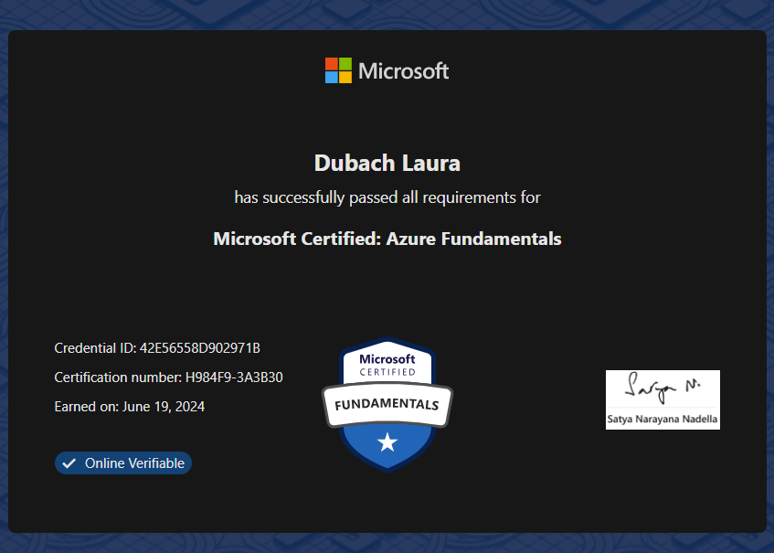
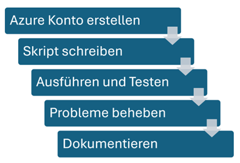

# Teil 4 Abschluss

> Back [Page](https://github.com/lauradubach/Semesterarbeit1/blob/main/Sites/Teil%203%20Realisieren.md)
>
> Back [Start](https://github.com/lauradubach/Semesterarbeit1/blob/main/README.md)

- [Teil 4 Abschluss](#teil-4-abschluss)
- [Auswerten](#auswerten)
  - [Zertifizierung](#zertifizierung)
  - [Implementierungsplan](#implementierungsplan)
  - [Auswertung Tests](#auswertung-tests)
  - [Zusammenfassung](#zusammenfassung)
  - [Reflexion](#reflexion)
  - [Quellen](#quellen)
  - [Glossar](#glossar)

# Auswerten
In diesem Kapitel wird das Projekt ausgewertet. Es wird erläutert wie das Projekt war und wie es nächstes mal auch besser gemacht werden könnte.

## Zertifizierung
Für den Theorie Nachweis dieser Arbeit habe ich das AZ-900 Zertifikat absolviert und bestanden:

https://learn.microsoft.com/api/credentials/share/en-us/DubachLaura-7204/42E56558D902971B?sharingId=EDE9AF3791EEEFD2

## Implementierungsplan

## Auswertung Tests
## Zusammenfassung
## Reflexion
## Quellen

Kapitel IPERKA, Site Einleitung
Bexio. (2020): Mit der IPERKA-Methode bessere Entscheidungen für Ihre KMU treffen. Aufgerufen am: 27.05.2024. Online unter: https://www.bexio.com/de-CH/blog/view/iperka-methode

Kapitel Bedürfnisse der Unternehmen, Site Vorbereitung
Chat GPT. (2024): Erhebung und Darstellung der spezifischen Bedürfnisse von Unternehmen hinsichtlich Datenvolumen, Zugriffszeiten und Sicherheit. Aufgerufen am: 28.05.2024. Online unter: https://chatgpt.com/c/868895b3-b58c-4d29-95c6-cf7e2b126c39

Kapitel Beschreibung Big Data, Site Vorbereitung
Chat GPT. (2024): Besonderheiten und Herausforderungen von Big Data (z. B. Volumen, Geschwindigkeit, Vielfalt, Auswertung). Aufgerufen am: 28.05.2024. Online unter: https://chatgpt.com/c/868895b3-b58c-4d29-95c6-cf7e2b126c39

Kapitel Produkt Vergleich, Site Vorbereitung
Chat GPT. (2024): Beschreibe mir den google cloud storage. Aufgerufen am: 03.06.2024. Online unter: https://chatgpt.com/c/fcc7372d-2c2c-46dd-bdc1-bf83965fece2

Kapitel Produkt Vergleich, Site Vorbereitung
Chat GPT. (2024): Bitte das gleiche für den azure blob storage. Aufgerufen am: 03.06.2024. Online unter: https://chatgpt.com/c/fcc7372d-2c2c-46dd-bdc1-bf83965fece2

Kapitel Produkt Vergleich, Site Vorbereitung
Chat GPT. (2024): Bitte mach mir eine tabelle mit den vor-und nachteilen von blob storage und von google cloud storage. Aufgerufen am: 03.06.2024. Online unter: https://chatgpt.com/c/fcc7372d-2c2c-46dd-bdc1-bf83965fece2

Kapitel Entscheidungsmatrix, Site Vorbereitung
Chat GPT. (2024): Kannst du mir eine Entscheidungsmatrix erstellen zu google cloud storage und azure blob storage. Azure blob storage soll gewinnen. Aufgerufen am: 05.06.2024. Online unter: https://chatgpt.com/c/015826d1-6244-499c-b532-002febf87dba

Kapitel Kostenanalyse, Site Vorbereitung
Google One. (2024): Abos und Preise. Aufgerufen am: 10.06.2024. Online unter: https://one.google.com/about/plans?hl=de&g1_landing_page=0

Kapitel Kostenanalyse, Site Vorbereitung
Microsoft. (2024): Azure Blob Storage – Preise. Aufgerufen am: 10.06.2024. Online unter: https://azure.microsoft.com/de-de/pricing/details/storage/blobs/#pricing

Kapitel Kostenanalyse, Site Vorbereitung
ChatGPT. (2024): Mach mir bitte eine Kostenanalyse vom Azure Blob Storage und Google Cloud Storage. Aufgerufen am: 10.06.2024. Online unter: https://chatgpt.com/c/78571786-8d35-4794-b488-51f2e033d5ee

## Glossar
